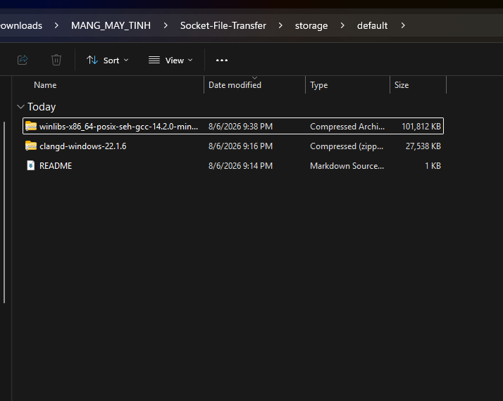

# Báo cáo kỹ thuật Giai đoạn 1 (Phase 1)

## 1. Cơ chế xử lý message boundary

### 1.1 Vấn đề của TCP
Giao thức TCP (Transmission Control Protocol) là một giao thức truyền tải hướng luồng (stream-oriented). TCP đảm bảo dữ liệu được gửi đến đích theo đúng thứ tự và không bị mất mát, tuy nhiên TCP không bảo toàn ranh giới của các gói tin (message boundary) mà ứng dụng gửi đi.

Điều này gây nên tình trạng nếu ứng dụng gửi 2 gói tin (ví dụ: `gói 1: 10 byte`, `gói 2: 20 byte`), ở phía nhận, hàm `recv()` có thể đọc được 30 byte cùng lúc, hoặc bị tách ra thành nhiều mảnh nhỏ tùy thuộc vào kích thước bộ đệm (buffer) và tình trạng mạng. Nếu không xử lý, chương trình sẽ không biết đâu là điểm kết thúc của gói tin thứ nhất và điểm bắt đầu của gói tin thứ hai.

### 1.2 Cơ chế đã chọn: Length-prefix framing
Để giải quyết vấn đề trên, trong Giai đoạn 1, nhóm đã chọn triển khai cơ chế **Length-prefix framing**. Cụ thể:
- **Nguyên lý hoạt động**: Trước mỗi đoạn dữ liệu (lệnh hoặc chunk file), nhóm chèn thêm một con số (đóng gói dạng nhị phân kích thước cố định) báo trước cho phía nhận biết kích thước chính xác của đoạn dữ liệu tiếp theo là bao nhiêu byte.
- **Chi tiết cài đặt trong `protocol.py`:**
  - Đối với các **lệnh văn bản** (như `LIST`, `UPLOAD filename`, `ACK`, `ERROR`): Nhóm dùng 4 byte (kiểu unsigned int `!I`) ở phần đầu gói tin. 4 byte này có khả năng biểu diễn kích thước lệnh lên tới 4GB, hoàn toàn dư dả cho các lệnh điều khiển.
  - Đối với các **chunk dữ liệu file**: Nhóm dùng 8 byte (kiểu unsigned long long `!Q`) ở phần đầu để có thể biểu diễn kích thước các file siêu lớn nếu cần truyền nguyên cục thay vì chia nhỏ.
- **Giải thích nguyên nhân nhóm lựa chọn:**
  - Dễ dàng cài đặt và hoạt động cực kỳ ổn định với mọi loại dữ liệu (kể cả dữ liệu nhị phân chứa các ký tự đặc biệt).
  - Khắc phục hoàn toàn tình trạng đọc dính (TCP kết dính nhiều thông điệp) hoặc thiếu byte (gói tin đến rải rác). Phía nhận (hàm `recv_exact` trong `framing.py`) chỉ việc đọc đúng số lượng byte như được báo trước trong phần header, sau đó xử lý trọn vẹn thông điệp.

---

## 2. Kết quả đo tốc độ truyền thực tế

Để kiểm chứng tính ổn định và tốc độ truyền của hệ thống trong Giai đoạn 1, nhóm đã tiến hành upload 3 file với các kích thước khác nhau. 

**Kích thước 3 file được lưu trong hệ thống tại thời điểm thực nghiệm:**


Dưới đây là trích xuất trực tiếp từ file log của server (`server_phase1.log`) minh chứng cho quá trình upload 3 file này:

### File 1: Kích thước rất nhỏ (`README.md`)
```log
2026-08-06 21:14:13,090 [INFO] - [('127.0.0.1', 52765)] Received cmd: UPLOAD README.md
2026-08-06 21:14:13,106 [INFO] - [('127.0.0.1', 52765)] UPLOAD README.md completed in 0.02s (11.10 KB/s)
```

### File 2: Kích thước trung bình (`clangd-windows-22.1.6.zip`)
```log
2026-08-06 21:15:55,796 [INFO] - [('127.0.0.1', 52765)] Received cmd: UPLOAD clangd-windows-22.1.6.zip
2026-08-06 21:16:19,193 [INFO] - [('127.0.0.1', 52765)] UPLOAD clangd-windows-22.1.6.zip completed in 23.40s (1177.04 KB/s)
```

### File 3: Kích thước lớn (`winlibs-x86_64-posix-seh-gcc-14.2.0-mingw-w64ucrt-12.0.0-r2.7z`)
```log
2026-08-06 21:37:15,413 [INFO] - [('127.0.0.1', 52917)] Received cmd: UPLOAD winlibs-x86_64-posix-seh-gcc-14.2.0-mingw-w64ucrt-12.0.0-r2.7z
2026-08-06 21:38:38,814 [INFO] - [('127.0.0.1', 52917)] UPLOAD winlibs-x86_64-posix-seh-gcc-14.2.0-mingw-w64ucrt-12.0.0-r2.7z completed in 83.40s (1220.75 KB/s)
```

**Nhận xét:**
- Quá trình upload thành công và trơn tru cho cả 3 kích thước file.
- Tốc độ truyền (trên localhost) dao động từ khoảng `1 MB/s` đến `1.2 MB/s`. Tốc độ này phản ánh quá trình phân mảnh dữ liệu (chunking), truyền tải và đọc ghi I/O lên ổ cứng.
- Hệ thống hoạt động tốt mà không gặp bất cứ lỗi tràn bộ nhớ (OOM) nào, minh chứng cơ chế đọc/ghi tuần tự và tính toán checksum dạng streaming hoạt động chính xác.
