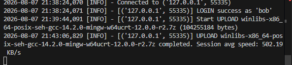
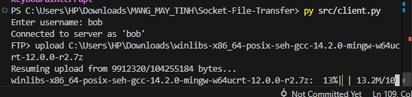
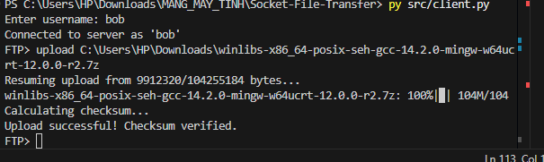

# **Báo Cáo Kỹ Thuật - Giai Đoạn 2**

## **1. Mô tả kiến trúc hệ thống**

Hệ thống được nâng cấp và tái thiết kế theo mô hình Bất đồng bộ (Asynchronous Non-blocking I/O) nhằm giải quyết bài toán xử lý đồng thời hiệu suất cao.

- **Mô hình cốt lõi:** Sử dụng thư viện `asyncio` của Python với kiến trúc Event-Driven. Thay vì mỗi Client chiếm dụng một Thread riêng (gây tốn kém bộ nhớ như ở Giai đoạn 1), toàn bộ Client giờ đây được phục vụ song song trên một Event Loop duy nhất.
- **Offload Blocking I/O:** Để tránh việc đọc/ghi file hoặc tính toán MD5 làm đóng băng Event Loop, các tác vụ nặng (Disk I/O, CPU-bound) được đẩy sang một Thread Pool riêng biệt thông qua hàm `run_in_executor`.
- **Cơ chế giới hạn kết nối:** Sử dụng `asyncio.Semaphore(MAX_CLIENTS)` hoạt động như một chốt chặn ở tầng trên cùng, lập tức từ chối các kết nối dôi dư nhằm bảo vệ máy chủ không bị quá tải.


## **2. Đặc tả giao thức tùy chỉnh**

Giao thức được chuyển đổi hoàn toàn từ văn bản sang dạng Nhị phân để tối ưu băng thông và tốc độ xử lý.

- **Cấu trúc gói tin:** Mọi thông điệp giao tiếp đều tuân thủ quy tắc đóng gói Header 8 byte cố định `[Length: 4 byte] [Opcode: 2 byte] [UserID: 2 byte] [Payload: ... byte]`.
- **Network Byte Order:** Tất cả các tham số số nguyên được đóng gói bằng thư viện `struct` với chuẩn Big-Endian (`!IHH`) để đảm bảo tính nhất quán trên đa nền tảng.
- **Tách bạch dữ liệu và điều khiển:** Các thao tác truyền file được chia nhỏ thành các gói `FILE_CHUNK` (Mặc định 16KB). Các lệnh điều khiển như `ACK`, `CHECKSUM_REQ`, `ERROR` được sử dụng để duy trì tính đồng bộ của State Machine giữa Client và Server.

### **2.1 Cấu trúc gói tin Chung (Header)**
Mọi gói tin truyền đi trong Giai đoạn 2 đều tuân theo một Header cố định dài 8 byte, cấu trúc như sau:

| Field | Size (Bytes) | Type | Mô tả |
| --- | --- | --- | --- |
| `Length` | 4 | Unsigned Int (`!I`) | Kích thước của phần Payload (không tính Header). Có thể lên tới 4GB. |
| `Opcode` | 2 | Unsigned Short (`!H`) | Mã lệnh định danh loại hành động. |
| `UserID` | 2 | Unsigned Short (`!H`) | Mã định danh client/user. (0 = Chưa đăng nhập). |

*Tất cả các số nguyên đều được đóng gói theo Network Byte Order (Big-Endian) sử dụng dấu `!` trong thư viện `struct`.*

### **2.2 Bảng Opcode**

| Opcode (Dec) | Opcode (Hex) | Tên lệnh | Hướng | Ý nghĩa |
| --- | --- | --- | --- | --- |
| 1 | `0x0001` | `LOGIN` | C -> S | Client đăng nhập kèm username. |
| 2 | `0x0002` | `LIST_REQ` | C -> S | Yêu cầu danh sách file trong thư mục cá nhân. |
| 3 | `0x0003` | `LIST_RESP` | S -> C | Trả về danh sách file (chuỗi cách nhau dấu phẩy). |
| 4 | `0x0004` | `UPLOAD_REQ` | C -> S | Yêu cầu tải file lên. Payload chứa thông tin file. |
| 5 | `0x0005` | `DOWNLOAD_REQ`| C -> S | Yêu cầu tải file về. Payload chứa tên file. |
| 6 | `0x0006` | `FILE_CHUNK` | C <-> S | Chứa dữ liệu thực sự của file. |
| 7 | `0x0007` | `CHECKSUM_REQ`| C -> S | Client gửi mã băm để verify sau khi UPLOAD. |
| 8 | `0x0008` | `CHECKSUM_RESP`| S -> C | Server trả mã băm cho client sau khi DOWNLOAD. |
| 9 | `0x0009` | `ACK` | S -> C | Trả về phản hồi thành công (có thể kèm dữ liệu như `next_offset`). |
| 10 | `0x000A` | `ERROR` | S -> C | Báo lỗi. Payload là chuỗi lý do lỗi. |

### **2.3 Cấu trúc Payload theo từng Opcode**

#### **2.3.1 `LOGIN` (0x01)**
- **Payload**: Chuỗi UTF-8 tên username (ví dụ: `Alice`).

#### **2.3.2 `LIST_REQ` (0x02)**
- **Payload**: Trống (0 bytes).

#### **2.3.3 `LIST_RESP` (0x03)**
- **Payload**: Chuỗi UTF-8 danh sách file, cách nhau dấu phẩy. Ví dụ: `file1.txt,file2.zip`.

#### **2.3.4 `UPLOAD_REQ` (0x04)**
- Dùng cho cả gửi mới và Resume (truyền tiếp).
- **Payload Format**: `[Kích thước file: 8 byte (!Q)] [Tên file: chuỗi UTF-8 còn lại]`

#### **2.3.5 `ACK` (0x09) trả lời cho `UPLOAD_REQ`**
- Server kiểm tra file trên đĩa, nếu file đã tồn tại và chưa đủ dung lượng, server trả về offset hiện tại để client resume.
- **Payload Format**: `[next_offset: 8 byte (!Q)]`
- Nếu file chưa tồn tại (tải mới), `next_offset` = 0.

#### **2.3.6 `DOWNLOAD_REQ` (0x05)**
- **Payload Format**: `[offset hiện có ở client: 8 byte (!Q)] [Tên file: chuỗi UTF-8 còn lại]`
- Client truyền `offset` lên để báo cho Server biết nó đang có bao nhiêu byte, Server sẽ chỉ gửi từ `offset` đó trở đi (Resume Download).

#### **2.3.7 `FILE_CHUNK` (0x06)**
- **Payload**: Dữ liệu thô của file (bytes). 

#### **2.3.8 `ERROR` (0x0A)**
- **Payload**: Chuỗi UTF-8 báo lỗi. (VD: `INVALID_FILE`, `MAX_CLIENTS_REACHED`).

### **2.4 Ví dụ luồng truyền tiếp (Resume)**
1. Client gửi `UPLOAD_REQ` (Payload: `8 byte size` + `"video.mp4"`).
2. Server check `storage/user/video.mp4`, nhận thấy có sẵn 10MB (10485760 bytes).
3. Server gửi lại `ACK` (Payload: `10485760` đóng gói 8 byte).
4. Client nhận được `ACK`, đọc file từ byte thứ 10485760.
5. Client liên tục gửi `FILE_CHUNK` đến khi hết file.

### **2.5 Ví dụ Hex Dump thực tế (Gói tin LOGIN)**

Giả sử Client gửi lệnh **LOGIN** với Username là `"Alice"` (`5` bytes). Client có `UserID` tạm thời là `0`.
- **Length**: 5 bytes (0x00 00 00 05)
- **Opcode**: 1 (0x00 01)
- **UserID**: 0 (0x00 00)
- **Payload**: "Alice" (0x41 0x6C 0x69 0x63 0x65)

**Hex Dump toàn bộ gói tin (13 bytes):**
```text
00 00 00 05 00 01 00 00 41 6C 69 63 65
|----Length---|--Op-|-ID--|--Payload---|
```
- `00 00 00 05`: 4 byte Header mô tả Length = 5.
- `00 01`: 2 byte Header mô tả Opcode = 1 (LOGIN).
- `00 00`: 2 byte Header mô tả UserID = 0.
- `41 6c 69 63 65`: 5 byte Payload chứa chuỗi ASCII "Alice".


## **3. Các lựa chọn kỹ thuật quan trọng**

### **3.1. Thuật toán Token Bucket (Giới hạn băng thông)**
- Để đáp ứng tiêu chí R2.6, nhóm đã thiết kế class `TokenBucket` giới hạn tốc độ luồng dữ liệu truyền tải theo cấu hình `SPEED_LIMIT_KBPS` (500 KB/s). Việc giới hạn được thực thi bằng cách tính toán thời gian `time.monotonic()` và `asyncio.sleep()` tương ứng với số byte được gửi, giúp tốc độ truyền duy trì ổn định, không vượt quá ngưỡng cấu hình +/- 10%.

### **3.2. Không gian lưu trữ độc lập**
- Để tránh Race Condition khi nhiều user thao tác cùng lúc (R2.3), mọi dữ liệu tải lên được điều hướng lưu trữ độc lập theo đường dẫn `storage/<username>/<filename>`. Việc này ngăn chặn triệt để hiện tượng ghi đè chéo hoặc lộ lọt dữ liệu giữa các người dùng.
- Chính sách trùng tên: Nếu một User upload file trùng tên đã có sẵn nhưng kích thước file cũ lớn hơn hoặc bằng, hệ thống tự động áp dụng chính sách ghi đè, xóa file cũ để tải file mới.

### **3.3. Cơ chế truyền tiếp (Offset-based resume)**
- Hệ thống hỗ trợ Resume cho cả 2 chiều Upload và Download. Khi một kết nối bị ngắt giữa chừng, Client hoặc Server sẽ kiểm tra dung lượng file đang tải dở trên đĩa cứng và đóng gói kích thước này (Offset) vào gói tin `UPLOAD_REQ` hoặc `ACK`. Phía còn lại sẽ thực hiện hành động nhảy (Seek) tới đúng offset tương ứng để bắt đầu đọc/ghi từ byte đó trở đi, tiết kiệm 100% tài nguyên mạng dư thừa.


## **4. Kết quả kiểm thử**

### **4.1. Bài kiểm tra độ ổn định & xử lý đa luồng**
- **Kịch bản:** Chạy script `tests/simulate_multi_client.py` với 10 Client ảo đồng loạt kết nối, đăng nhập và xả dữ liệu dồn dập vào Server.
- **Kết quả:**
  - 10 Client xử lý thành công không xảy ra Deadlock.
  
```text
2026-08-07 21:32:15,721 [INFO] - Connected to ('127.0.0.1', 53322)
2026-08-07 21:32:15,722 [INFO] - Connected to ('127.0.0.1', 53323)
2026-08-07 21:32:15,723 [INFO] - Connected to ('127.0.0.1', 53324)
2026-08-07 21:32:15,724 [INFO] - Connected to ('127.0.0.1', 53325)
2026-08-07 21:32:15,724 [INFO] - Connected to ('127.0.0.1', 53326)
2026-08-07 21:32:15,725 [INFO] - Connected to ('127.0.0.1', 53327)
2026-08-07 21:32:15,726 [INFO] - Connected to ('127.0.0.1', 53328)
2026-08-07 21:32:15,728 [INFO] - Connected to ('127.0.0.1', 53329)
2026-08-07 21:32:15,729 [INFO] - Connected to ('127.0.0.1', 53330)
2026-08-07 21:32:15,730 [INFO] - Connected to ('127.0.0.1', 53331)
2026-08-07 21:32:15,731 [INFO] - [('127.0.0.1', 53323)] LOGIN success as 'bot_2'
2026-08-07 21:32:15,734 [INFO] - [('127.0.0.1', 53328)] LOGIN success as 'bot_7'
2026-08-07 21:32:15,734 [INFO] - [('127.0.0.1', 53329)] LOGIN success as 'bot_8'
2026-08-07 21:32:15,736 [INFO] - [('127.0.0.1', 53326)] LOGIN success as 'bot_5'
2026-08-07 21:32:15,738 [INFO] - [('127.0.0.1', 53322)] LOGIN success as 'bot_1'
2026-08-07 21:32:15,738 [INFO] - [('127.0.0.1', 53327)] LOGIN success as 'bot_6'
2026-08-07 21:32:15,739 [INFO] - [('127.0.0.1', 53330)] LOGIN success as 'bot_9'
2026-08-07 21:32:15,740 [INFO] - [('127.0.0.1', 53331)] LOGIN success as 'bot_10'
2026-08-07 21:32:15,741 [INFO] - [('127.0.0.1', 53324)] LOGIN success as 'bot_3'
2026-08-07 21:32:15,741 [INFO] - [('127.0.0.1', 53325)] LOGIN success as 'bot_4'
2026-08-07 21:32:15,893 [INFO] - [('127.0.0.1', 53327)] Start UPLOAD dummy_6.bin (10167 bytes)
2026-08-07 21:32:15,897 [INFO] - [('127.0.0.1', 53327)] UPLOAD dummy_6.bin completed. Session avg speed: 3244.57 KB/s
2026-08-07 21:32:15,913 [INFO] - Disconnected from ('127.0.0.1', 53327)
2026-08-07 21:32:15,920 [INFO] - [('127.0.0.1', 53326)] Start UPLOAD dummy_5.bin (39000 bytes)
2026-08-07 21:32:15,928 [INFO] - [('127.0.0.1', 53328)] Start UPLOAD dummy_7.bin (12852 bytes)
2026-08-07 21:32:15,932 [INFO] - [('127.0.0.1', 53326)] UPLOAD dummy_5.bin completed. Session avg speed: 7940.35 KB/s
2026-08-07 21:32:15,934 [INFO] - [('127.0.0.1', 53328)] UPLOAD dummy_7.bin completed. Session avg speed: 5188.43 KB/s
2026-08-07 21:32:15,948 [INFO] - Disconnected from ('127.0.0.1', 53326)
2026-08-07 21:32:15,955 [INFO] - [('127.0.0.1', 53330)] Start UPLOAD dummy_9.bin (28420 bytes)
2026-08-07 21:32:15,956 [INFO] - Disconnected from ('127.0.0.1', 53328)
2026-08-07 21:32:15,958 [INFO] - [('127.0.0.1', 53330)] UPLOAD dummy_9.bin completed. Session avg speed: 12577.88 KB/s
2026-08-07 21:32:15,976 [INFO] - Disconnected from ('127.0.0.1', 53330)
2026-08-07 21:32:15,990 [INFO] - [('127.0.0.1', 53331)] Start UPLOAD dummy_10.bin (40418 bytes)
2026-08-07 21:32:15,994 [INFO] - [('127.0.0.1', 53331)] UPLOAD dummy_10.bin completed. Session avg speed: 20368.13 KB/s
2026-08-07 21:32:16,009 [INFO] - Disconnected from ('127.0.0.1', 53331)
2026-08-07 21:32:16,014 [INFO] - [('127.0.0.1', 53324)] Start UPLOAD dummy_3.bin (10598 bytes)
2026-08-07 21:32:16,018 [INFO] - [('127.0.0.1', 53324)] UPLOAD dummy_3.bin completed. Session avg speed: 4272.58 KB/s
2026-08-07 21:32:16,037 [INFO] - Disconnected from ('127.0.0.1', 53324)
2026-08-07 21:32:16,040 [INFO] - [('127.0.0.1', 53323)] Start UPLOAD dummy_2.bin (14237 bytes)
2026-08-07 21:32:16,043 [INFO] - [('127.0.0.1', 53323)] UPLOAD dummy_2.bin completed. Session avg speed: 7231.49 KB/s
2026-08-07 21:32:16,055 [INFO] - [('127.0.0.1', 53325)] Start UPLOAD dummy_4.bin (15385 bytes)
2026-08-07 21:32:16,062 [INFO] - Disconnected from ('127.0.0.1', 53323)
2026-08-07 21:32:16,064 [INFO] - [('127.0.0.1', 53325)] UPLOAD dummy_4.bin completed. Session avg speed: 6949.38 KB/s
2026-08-07 21:32:16,080 [INFO] - Disconnected from ('127.0.0.1', 53325)
2026-08-07 21:32:16,086 [INFO] - [('127.0.0.1', 53329)] Start UPLOAD dummy_8.bin (28205 bytes)
2026-08-07 21:32:16,090 [INFO] - [('127.0.0.1', 53329)] UPLOAD dummy_8.bin completed. Session avg speed: 13346.54 KB/s
2026-08-07 21:32:16,101 [INFO] - Disconnected from ('127.0.0.1', 53329)
2026-08-07 21:32:16,167 [INFO] - [('127.0.0.1', 53322)] Start UPLOAD dummy_1.bin (40397 bytes)
2026-08-07 21:32:16,172 [INFO] - [('127.0.0.1', 53322)] UPLOAD dummy_1.bin completed. Session avg speed: 15821.97 KB/s
2026-08-07 21:32:16,195 [INFO] - Disconnected from ('127.0.0.1', 53322)
```

### **4.2. Bài kiểm tra giới hạn băng thông & tracking thời gian thực**
- **Kịch bản:** Upload và Download file `winlibs-x86_64-posix-seh-gcc-14.2.0-mingw-w64ucrt-12.0.0-r2` (Kích thước ~99.4MB).
- **Kết quả:**
  - Thanh tiến trình `tqdm` trên Terminal hiển thị liên tục phần trăm theo thời gian thực dựa trên từng khối byte (16KB) được truyền qua Socket.
  - Tốc độ hội tụ và duy trì ổn định ở mức ~502 KB/s (Gần tuyệt đối với cấu hình 500 KB/s do tính chất Burst của Token Bucket).

<p align="center">
  
</p>

### **4.3. Bài kiểm tra resume & checksum**
- **Kịch bản:** Upload file 104MB, ngắt kết nối `Ctrl+C` tại thời điểm 9%. Sau đó chạy lại lệnh upload đúng file đó.
- **Kết quả:** 
  - Terminal ghi nhận rõ ràng: `Resuming upload from 9912320/104255184 bytes...`
  - Cuối quá trình tải, MD5 Hash giữa Client và Server khớp nhau hoàn toàn, Terminal báo `Upload successful! Checksum verified.`.

<p align="center">
  
</p>

<p align="center">
  
</p>
